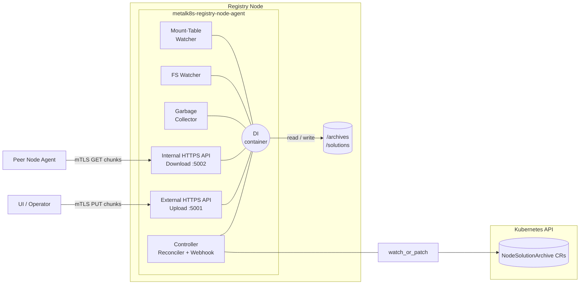
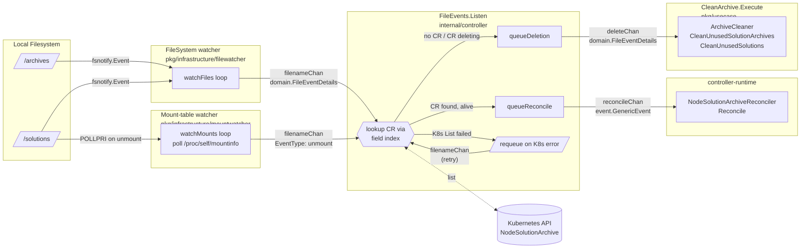
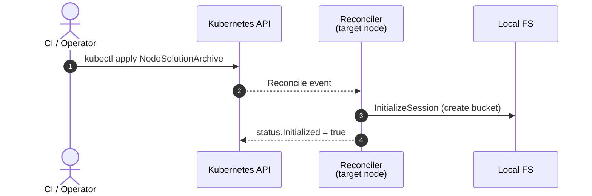
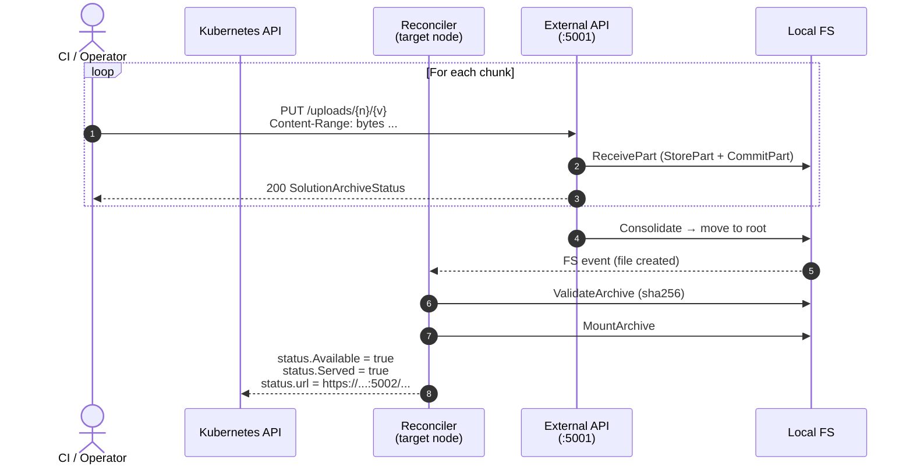
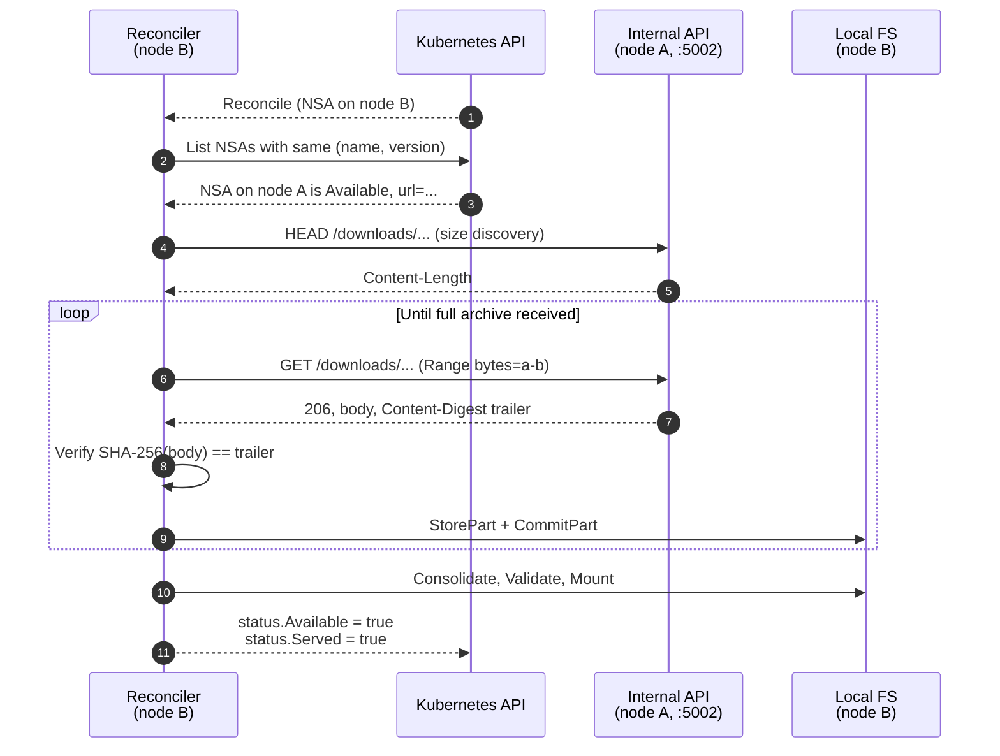

# MetalK8s Registry Node Agent - Design Document

## 1. Context

A MetalK8s cluster ships its container images as **solution archives** — large ISO files that must be made available locally on every node tagged as registry. Once available, each registry node serves those archives to the rest of the cluster through a local OCI registry.

The **MetalK8s Registry Node Agent** ("the agent") proposes a workflow with a Kubernetes-native, declarative, peer-to-peer distribution mechanism:

- A custom resource (`NodeSolutionArchive`) declares, per node, which archive/version must be present.
- A user uploads an archive **once** through an HTTPS API exposed by any registry node. This API is secured and authenticated through mTLS.
- After optional validation, the agent mounts the Solution Archive and tags it as "Available" to make it downloadable by other nodes.
- The other agents reconcile their resources: they pull the archive from the peer that already has it, validate it, mount it, and report their status back on the resources.

## 2. Goals and Non-Goals

### 2.1 Goals

- **Declarative distribution**: drive archive presence on every registry node through a Kubernetes Custom Resource.
- **Resumable uploads**: accept arbitrarily large ISOs via HTTP `Content-Range` based multipart PUTs.
- **Peer-to-peer replication**: once an archive is available on a single registry node, the other registry nodes pull it from peers (no central storage required).
- **End-to-end integrity**: optionally, verify the SHA-256 of the full archive against the value declared in the CR, and the SHA-256 of every downloaded chunk on the wire (`Content-Digest` trailer, RFC 9530).
- **Defense in depth**: TLS for confidentiality, mTLS for authentication on both the upload (external) and download (internal) endpoints.
- **Self-healing storage**: a periodic garbage collector removes archives, buckets and mount points that no longer match any active resource.
- **Operational visibility**: status sub-resource exposes `Initialized`, `Available`, `Served` flags and `Conditions`; standard liveness / readiness probes are exposed for Kubernetes.

### 2.2 Non-Goals

- The agent **does not** run an OCI registry; it only provides the on-disk artifacts a sibling registry component will serve.
- The agent **does not** schedule itself; it expects to be deployed as a `StatefulSet` on nodes already labelled `node-role.kubernetes.io/registry`.
- The agent **does not** provide a UI; only HTTP and Kubernetes APIs.
- The agent **does not** manage cluster-wide retention policies; cleanup is driven exclusively by the absence of a matching `NodeSolutionArchive`.
- The agent **does not** replace `cert-manager`; it only consumes certificates produced by it (or by any X.509 issuer of choice).

## 3. Glossary

| Term                          | Definition                                                                              |
|-------------------------------|-----------------------------------------------------------------------------------------|
| **Solution archive (SA)**     | An ISO containing one or more MetalK8s component images.                                |
| **NodeSolutionArchive (NSA)** | Custom resource declaring a (`name`, `version`) SA must be present on a given node.     |
| **Registry node**             | A Kubernetes node carrying the `node-role.kubernetes.io/registry` label.                |
| **Session**                   | An in-progress multipart upload of an SA, materialised as a *bucket* on disk.           |
| **Bucket**                    | A flat directory holding the metadata, recipient file and parts synthesis of a session. |
| **Part / chunk**              | A contiguous byte range of an SA carried by a single HTTP request.                      |
| **Mount**                     | A read-only ISO9660 mount (or equivalent layout) exposed under `SOLUTIONS_LOCATION`.    |
| **External API**              | The upload-facing HTTP service, exposed on `EXTERN_ADDR` (default `:5001`).             |
| **Internal API**              | The peer-to-peer download HTTP service, exposed on `INTERN_ADDR` (default `:5002`).     |

## 4. High-Level Architecture

The agent runs as a **single binary** but hosts **three concurrent runtimes** sharing one in-process dependency container:

1. A **controller-runtime manager** running the `NodeSolutionArchive` reconciler and the validating webhook.
2. Two **HTTP servers** (external upload + internal download).
3. A **filesystem watcher**, a **mount-table watcher** and a **garbage-collector goroutine** keeping the on-disk state in sync with the desired state expressed by the CRs.

The **filesystem watcher** (fsnotify) reacts to files appearing, changing or being deleted; the **mount-table watcher** complements it by polling the OS mount table to catch out-of-band *unmounts* of solution archives — a case fsnotify does not reliably report (see §5.4 / §5.5).



### 4.1 Layered (Clean) Architecture

The Go code is organised in concentric layers; **dependencies always point
inward**:

```
┌─────────── Presentation ─────────┐  ┌────────── Operator ────────────┐
│ pkg/presentation/http/           │  │ cmd/main.go                    │
│ {extern,intern,handler,resolver} │  │ internal/{controller,webhook}  │
└──────────────────────────────────┘  └────────────────────────────────┘
                 │                                    │
                 ▼                                    ▼
┌──────────────────────────── Use cases ───────────────────────────────┐
│  pkg/usecase/*  (InitializeSession, ReceivePart, ValidateArchive,    │
│                  DescribeArchive, DownloadPart,                      │
│                  ServerPart, MountArchive, UnmountArchive,           │
│                  RemoveArchive, RemoveSession, CleanArchive)         │
└──────────────────────────────────────────────────────────────────────┘
                       │                       │
                       ▼                       ▼
┌──────────────────────────── Services ────────────────────────────────┐
│  pkg/service/*  (interfaces only — no implementation)                │
└──────────────────────────────────────────────────────────────────────┘
                       │                       │
                       ▼                       ▼
┌──────────────────────────── Domain ──────────────────────────────────┐
│  pkg/domain/*  (SolutionArchive, Part, SessionStatus, errors, ...)   │
└──────────────────────────────────────────────────────────────────────┘

         Wired together by pkg/infrastructure/di/*
         Service implementations live under pkg/infrastructure/<service>/
```

This layout keeps the **domain** and **use cases** pure Go (no Kubernetes, no HTTP, no filesystem) and concentrates side-effects in `pkg/infrastructure/`. As a side effect, every use case is unit-testable with simple mocks of the service interfaces.

### 4.2 Process Topology

| Goroutine                | Owner                | Lifetime                          |
|--------------------------|----------------------|-----------------------------------|
| controller-runtime mgr   | `cmd/main.go`        | Until `SIGTERM` / `SIGINT`        |
| External HTTPS server    | `cmd/main.go`        | Until shutdown                    |
| Internal HTTPS server    | `cmd/main.go`        | Until shutdown                    |
| Garbage collector        | `CleanArchive` UC    | Background loop, started at boot  |
| FS watcher               | `FileSystemWatcher`  | Background loop, started at boot  |
| Mount-table watcher      | `mountwatcher.FileSystem` | Background loop, started at boot; stopped *before* `filenameChan` closes |
| File-event listener      | `controller.FileEvents` | Triggers reconciles from FS events |

Inter-goroutine communication is performed exclusively through three typed channels created in `main()` (`filenameChan`, `reconcileChan`, `deleteChan`), keeping the dependency container immutable after wiring. The mount-table watcher reuses the existing `filenameChan` rather than introducing a fourth channel — it is therefore shut down first (via `StopWatchMounts`) so that `filenameChan` is never closed while a producer is still writing to it.

## 5. Custom Resource: `NodeSolutionArchive`

The CR is **cluster-scoped** because each instance targets a specific node and must survive namespace boundaries. Its API group / kind is `metalk8s.scality.com/v1alpha1, NodeSolutionArchive`.

### 5.1 Spec

```yaml
spec:
  name:    metalk8s        # immutable, regex-validated
  version: 1.25.3          # immutable
  nodeName: worker-1       # immutable, target registry node
  validation:              # optional, immutable as a whole
    checksum:
      type: sha256         # only sha256 is supported
      value: <hex>         # expected SHA-256 of the full archive
```

Immutability is enforced by **CEL validation rules** declared on the CRD itself, plus a defensive admission webhook (`internal/webhook/v1alpha1/nodesolutionarchive_webhook.go`).

### 5.2 Status

```yaml
status:
  initialized: true   # session bucket is ready to receive bytes
  available:   true   # archive file exists on disk and matches the checksum
  served:      true   # archive is mounted under SOLUTIONS_LOCATION
  url:         https://10.0.0.5:5002/api/v1/downloads/metalk8s/1.25.3
  conditions:
    - type: Initialized
      status: "True"
      reason: UploadReady
    - type: Available
      status: "True"
      reason: ImagesAvailable
    - type: Served
      status: "True"
      reason: ImagesServed
```

`status.url` is the **internal** download URL that peer nodes will use to pull the archive from this node.

### 5.3 Reconciliation Loop

`internal/controller/nodesolutionarchive_controller.go` implements the loop as a sequence of guarded steps.
Pseudo-code:

```text
1. Get NSA. Not found → return.
2. If !DeletionTimestamp:
       ensure finalizer "metalk8s.scality.com/finalizer".
   Else:
       run cleanup (Unmount, RemoveArchive, RemoveSession);
       drop finalizer; return.
3. defer: patch status.
4. InitializeSessionUseCase  → status.Initialized
5. If not Available, look for a sibling NSA (same name+version, other node)
   whose status.Available == true:
       DownloadPartUseCase(url=peer.status.url)
6. ValidateArchiveUseCase    (size + SHA-256)
   - invalid → Unmount + clear url + return (will retry on next event)
7. status.url = "<DOWNLOAD_BASE_URL>/<name>/<version>"
   status.Available = true
   RemoveSessionUseCase     (best-effort cleanup of bucket)
8. MountArchiveUseCase       → status.Served
```

### 5.4 Watch Strategy

The reconciler installs three field indexes to keep watch fan-out cheap:

| Index name                            | Key                                           |
|---------------------------------------|-----------------------------------------------|
| `SolutionArchiveNameVersion`          | `<name>:<version>`                            |
| `LocalSolutionArchiveNameVersion`     | `<name>:<version>` if `nodeName == NODE_NAME` |
| `LocalSolutionArchiveName`            | `<name>` if `nodeName == NODE_NAME`           |

Two predicates split the events:

- `ensureSameNode` — reconcile NSAs that target this node (`For(...)`).
- `ensureOtherNode` — when a *peer* NSA flips to `Available`, enqueue our local NSA with the same `(name, version)` so it can pull from that peer.

A third source — the in-process channel `EventChan` — lets the filesystem watcher trigger a reconciliation when the archive file appears, disappears or changes on disk. This handles the "manual `scp`" case and the end-of-upload / end-of-download events.

The same channel is also fed by the **mount-table watcher** (`pkg/infrastructure/mountwatcher`): fsnotify does not reliably emit an event when a mount point is *unmounted*, so a dedicated goroutine polls the OS mount table and, when a solution mount disappears out-of-band (e.g. a manual `umount` or a node reboot leaving the mount stale), enqueues a `FileEventDetails` with `EventType: "unmount"`. That event type matches no fsnotify op and so falls through to `handleSolutionDefault`, queueing a reconcile that re-mounts the archive.

### 5.5 File-Watcher and File-Event Processes and Garbage Collector

| Channel         | Element type              | Producer                                 | Consumer                                 |
|-----------------|---------------------------|------------------------------------------|------------------------------------------|
| `filenameChan`  | `domain.FileEventDetails` | `FileSystem.watchFiles` (fsnotify loop) **and** `mountwatcher.FileSystem.watchMounts` (poll(2)) | `controller.FileEvents.Listen`           |
| `reconcileChan` | `event.GenericEvent`      | `controller.FileEvents.queueReconcile`   | controller-runtime (`source.Channel`)    |
| `deleteChan`    | `domain.FileEventDetails` | `controller.FileEvents.queueDeletion`    | `usecase.CleanArchive.Execute` (GC loop) |

The dispatch logic lives in `controller.FileEvents` (`internal/controller/file_events.go`): for each raw FS event it looks up the matching `NodeSolutionArchive` CR through the `LocalSolutionArchiveNameVersion` / `LocalSolutionArchiveName` field indexes and decides whether the event must trigger a reconcile, a deletion on disk, or be silently dropped. If the Kubernetes API call fails, the event is pushed back onto `filenameChan` to be retried later.



Two design properties follow directly from this layout:

- **No shared mutable state between goroutines.** The watcher does not know anything about Kubernetes, the dispatcher does not touch the filesystem, and the GC does not call the API server. Each side-effect is owned by exactly one goroutine. The one exception is the mount-table watcher's mount snapshot, which the reconciler updates through the `ArchiveMounter` (`RecordMount` / `RecordUnmount` on mount / unmount); that snapshot is the watcher's private state and is guarded by a mutex, so a controller-initiated unmount is never mistaken for an out-of-band disappearance.
- **Bounded and self-healing retry.** A transient API error becomes a `filenameChan` re-enqueue; a transient cleanup error becomes a re-`AddWatch` so the next FS event will recreate the deletion request. This keeps the agent eventually consistent without any explicit retry queue.

Channels are created in `cmd/main.go` and closed in reverse order at shutdown (`filenameChan` → `reconcileChan` → `deleteChan`), guaranteeing that each consumer drains before its producer disappears.

## 6. Storage Layout

Two directories are managed (locations are configurable):

```
${SOLUTION_ARCHIVES_LOCATION}/        # default: /archives
├── .storageprovider/                 # internal control directory
├── .bucket.<name>-<version>/         # session bucket while uploading
│   ├── <solution>.meta               # SolutionArchive manifest
│   ├── <solution>.recipient          # sparse file receiving the parts
│   └── <solution>.parts              # synthesis of committed parts
└── <name>-<version>.iso              # consolidated archive (final state)

${SOLUTIONS_LOCATION}/                # default: /solutions
└── <name>/<version>/                 # mount point used by the registry
```

Buckets are flat (no nested buckets), implementations must be thread-safe, and any retained state lives **on the storage backend itself** — not in process memory — so the agent can be restarted at any time.

## 7. APIs

### 7.1 External Upload API (`:5001`)

OpenAPI: [`pkg/presentation/http/extern/uploads-openapi.yaml`](pkg/presentation/http/extern/uploads-openapi.yaml).

| Verb | Path                                  | Purpose                                |
|------|---------------------------------------|----------------------------------------|
| PUT  | `/api/v1/uploads/{name}/{version}`    | Upload one chunk of an archive.        |

- Authentication: **mTLS**, CA configured via `EXTERN_SERVER_AUTHN_CA_CERT_FILE_PATH`.
- Required headers: `Content-Range: bytes <start>-<end>/<total>` and `Content-Type: application/octet-stream`.
- Behavior: drives the `ReceivePart` use cases.
- Response: a JSON `SolutionArchiveStatus` listing committed chunks and an `isCompleted` flag — completion triggers consolidation and the archive's move to its final path.

### 7.2 Internal Download API (`:5002`)

OpenAPI: [`pkg/presentation/http/intern/downloads-openapi.yaml`](pkg/presentation/http/intern/downloads-openapi.yaml).

| Verb | Path                                    | Purpose                                              |
|------|-----------------------------------------|------------------------------------------------------|
| HEAD | `/api/v1/downloads/{name}/{version}`    | Returns total size via `Content-Length` (size discovery). |
| GET  | `/api/v1/downloads/{name}/{version}`    | Returns one chunk; `Range` header selects bytes.     |

- Authentication: **mTLS**, CA configured via `INTERN_SERVER_AUTHN_CA_CERT_FILE_PATH`. The matching client side is configured via `INTERN_CLIENT_*` environment variables.
- The GET response is a `206 Partial Content` carrying:
  - `Content-Range: bytes <start>-<end>/<total>`
  - `Content-Digest: sha-256=:<base64>:` as an **HTTP trailer** ([RFC 9530](https://www.rfc-editor.org/rfc/rfc9530)) — verified by the receiver before persisting the chunk.
- Server bind address: `INTERN_ADDR`; advertised host (used in `status.url`): `DOWNLOAD_HOST`.

### 7.3 Operational Endpoints

Provided by the controller-runtime manager on `:8081`:

| Path        | Purpose                                          |
|-------------|--------------------------------------------------|
| `/healthz`  | Liveness probe                                   |
| `/readyz`   | Readiness probe                                  |
| `/metrics`  | Prometheus metrics (controller-runtime defaults) |

## 8. End-to-End Flows

### 8.1 Creation of a new SolutionArchive



### 8.2 First Upload of a New Archive



### 8.3 Peer-to-Peer Replication

When a second `NodeSolutionArchive` exists — same `(name, version)` but targeting another registry node — that node's reconciler detects an already-`Available` sibling and pulls the archive directly from the peer:



### 8.4 Deletion

`kubectl delete nodesolutionarchive ...` triggers the finalizer path:
`UnmountArchive` → `RemoveArchive` → `RemoveSession`, then the finalizer is removed and Kubernetes garbage-collects the CR.

## 9. Use Case Catalog

| Use case                       | Triggered by                | Responsibility                                                           |
|--------------------------------|-----------------------------|--------------------------------------------------------------------------|
| `InitializeSession`            | Reconciler (step 4)         | Create bucket + metadata + recipient file. Idempotent.                   |
| `ReceivePart`                  | External API                | Persist a chunk, update parts synthesis, consolidate when complete.      |
| `ValidateArchive`              | Reconciler (step 6)         | Compare archive size and SHA-256 against the `validation.checksum`.      |
| `DescribeArchive`              | Internal API (HEAD)         | Return total size of an archive without reading it.                      |
| `DownloadPart`                 | Reconciler (step 5)         | Pull every missing chunk from a peer's internal API, verify digests.     |
| `ServePart`                    | Internal API (GET)          | Stream one byte range with `Content-Digest` trailer.                     |
| `MountArchive` / `UnmountArchive` | Reconciler (step 8 / cleanup) | Materialise / unmount the archive under `${SOLUTIONS_LOCATION}`.    |
| `RemoveArchive` / `RemoveSession` | Reconciler / GC          | Delete the consolidated file / bucket.                                   |
| `CleanArchive`                 | GC goroutine                | Periodically reconcile FS state with the set of live NSAs.               |

## 10. Concurrency Model

The agent assumes **strict per-archive serialisation**:

- Two locker services (`bucketLocker`, `archiveLocker`) implement `LockerUnlocker` and are scoped on `(name, version)`. Use cases acquire them in a fixed order (`bucket` first, then `archive`) to avoid deadlocks.
- The `StorageProvider` contract requires implementations to be internally thread-safe; the locker services are layered *on top* to enforce use-case-level invariants (e.g. "no upload while a session is being garbage-collected").
- The reconciler is single-threaded **per resource** (controller-runtime default); concurrency across different `(name, version)` pairs is fine.
- HTTP handlers do **not** hold locks across full requests; they delegate to a use case which scopes its critical section.

## 11. Security

| Concern               | Mitigation                                                                 |
|-----------------------|----------------------------------------------------------------------------|
| Confidentiality       | TLS on both APIs.      |
| Authentication        | mTLS on both APIs; client CAs are operator-supplied and rotated by `cert-manager`. |
| Authorization         | Kubernetes RBAC for NSA + status + finalizers (kubebuilder markers in the controller). |
| Integrity (at rest)   | SHA-256 of the full archive recomputed by `ValidateArchive`.               |
| Integrity (on wire)   | Per-chunk SHA-256 in the `Content-Digest` trailer (RFC 9530).              |
| Tampering of CRs      | CEL `XValidation: "self == oldSelf"` on every meaningful field; webhook as defence in depth. |
| Privilege of pod      | Runs only on labelled nodes via the operator's `StatefulSet` node selector.  |

The agent never trusts a peer's `status.url` blindly: chunks fetched from that URL are validated both per-chunk (`Content-Digest`) and end-to-end (`ValidateArchive`).

## 12. Observability

- **Logging**: structured logs via the standard library `log/slog` (use cases) and `zap` / `controller-runtime` (controller, webhook). Verbosity is controlled by `LOGGER_LOG_LEVEL` (use cases) and `--zap-log-level` (controller).
- **Metrics**: controller-runtime exposes the standard set (workqueue depth, reconcile latency, errors). Domain-specific metrics (`/metrics` upload/download counters and durations) are not yet implemented.
- **Resource status**: `kubectl get nsa` shows `Initialized`, `Available`, `Served` columns so operators can spot any node lagging behind without reading logs.

## 13. Streaming and cache

To avoid memory overflow, all part uploads, downloads and hashing are streamed (`io.Copy` / `io.TeeReader`) instead of being buffered fully in memory.

During these phases (uploading, hashing or downloading a solutionArchive part), the written or read data is transiently held in the Linux page cache. This cache is reclaimable: the kernel evicts it under memory pressure, so it cannot by itself cause an OOM kill.

After multiple tests, we conclude that:
* the page cache is reclaimed before reaching the memory limits defined under the `resources` section, and
* no OOM kill was observed.
